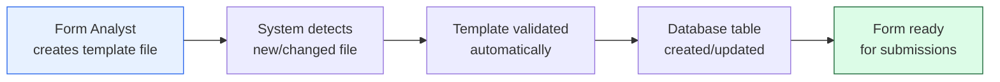
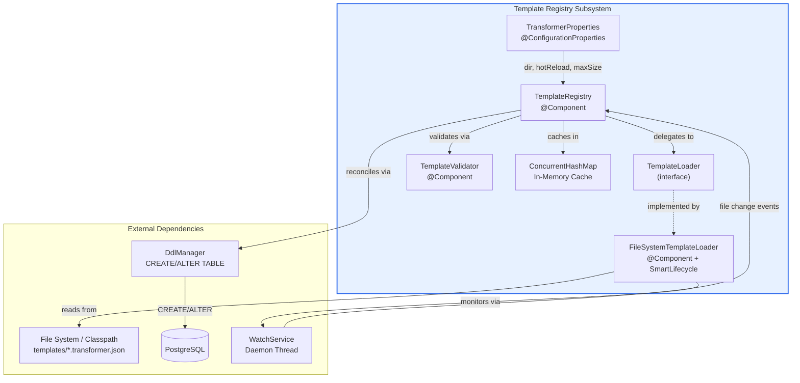
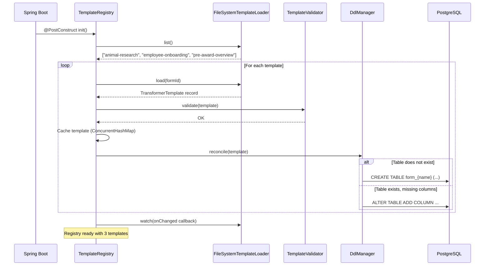
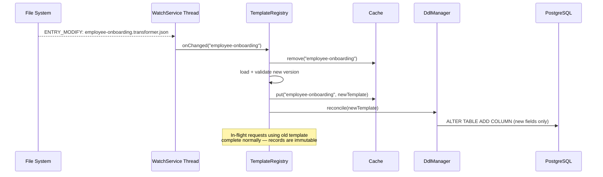
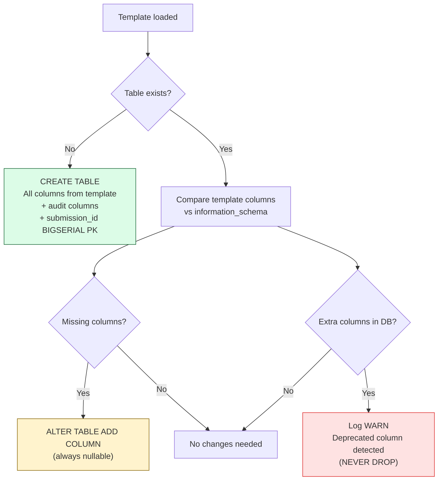

# Template Registry: Configuration-Driven Form Management

## Executive Summary

### The Business Problem

Every time a new government form needs to be added to the Pre-Award Review system, the traditional approach requires a developer to write custom database tables, API endpoints, and mapping code. This creates a bottleneck: form changes wait in a development queue, and each change carries the risk of introducing bugs into the production system.

### The Solution

The **Template Registry** eliminates this bottleneck by making form configuration entirely data-driven. Instead of writing code, an administrator creates a simple JSON configuration file — called a **Transformer Template** — that describes how a form's fields map to database columns. The system reads these templates automatically, creates the necessary database tables, and handles all data storage without any code changes.

### Key Business Benefits

- **No code deployments for new forms** — Drop a JSON file into the templates directory and the system handles the rest
- **Zero-downtime schema changes** — New fields can be added to existing forms while the system is running; no restart required
- **Safe by design** — The system will never delete data. Removed fields are flagged for review but their data is preserved
- **Audit trail** — Every template version is recorded, enabling historical reconstruction of form data exactly as it was submitted
- **Reduced development cost** — Form analysts can define templates without requiring backend developer involvement

### How It Works (Non-Technical)



1. A form analyst writes a JSON template file describing the form's fields, their data types, and any validation rules
2. The file is placed in the templates directory (or deployed via the standard release process)
3. The system automatically detects the file, validates it, and creates the corresponding database table
4. Users can immediately begin submitting data through the form
5. If the template is updated (e.g., a new field is added), the system detects the change and adds the new column — without losing existing data

---

## Technical Reference

### Architecture Overview

The Template Registry is a Spring Boot component subsystem under `com.egs.rjsf.transformer.registry` that manages the lifecycle of Transformer Templates — JSON configuration files that drive the entire form-to-relational mapping engine.



### Components

| Component | Class | Responsibility |
|-----------|-------|----------------|
| **Properties** | `TransformerProperties` | Binds `transformer.*` config from `application.yml` |
| **Loader Interface** | `TemplateLoader` | Abstracts template source (filesystem, S3, Git — pluggable) |
| **Filesystem Loader** | `FileSystemTemplateLoader` | Reads `{formId}.transformer.json` files from disk or classpath; runs `WatchService` for hot reload |
| **Validator** | `TemplateValidator` | Programmatic validation: formId not blank, version > 0, fields have jsonPath/column/sqlType, relations have childTable |
| **Registry** | `TemplateRegistry` | Central facade: caching (`ConcurrentHashMap`), loading, validation, DDL reconciliation, hot-reload callback |

### Configuration

```yaml
# application.yml
transformer:
  template:
    dir: ${TRANSFORMER_TEMPLATE_DIR:classpath:templates}   # Template file location
    hot-reload: ${TRANSFORMER_HOT_RELOAD:true}             # Enable filesystem watching
  cache:
    max-size: ${TRANSFORMER_CACHE_MAX_SIZE:500}             # Max cached templates
```

| Property | Default | Description |
|----------|---------|-------------|
| `transformer.template.dir` | `classpath:templates` | Directory containing `.transformer.json` files. Supports `classpath:` prefix for embedded templates or absolute filesystem paths for external templates. |
| `transformer.template.hot-reload` | `true` | When `true` and using a filesystem path (not classpath), a background `WatchService` thread monitors for file changes. Automatically disabled for classpath resources. |
| `transformer.cache.max-size` | `500` | Maximum number of templates held in the in-memory cache. |

### Template File Format

Templates are named `{formId}.transformer.json` and placed in the configured template directory. Here is an annotated example:

```json
{
  "formId": "pre-award-overview",          // Unique ID, matches filename prefix
  "version": 1,                            // Incremented on each template change
  "tableName": "form_pre_award_overview",  // Target PostgreSQL table
  "description": "Pre-Award Overview",     // Human-readable description

  "schemaVersion": {                       // Column that tracks template version per row
    "column": "schema_version",
    "sqlType": "INTEGER"
  },

  "auditColumns": {                        // Auto-populated audit trail columns
    "createdAt": "created_at",
    "updatedAt": "updated_at",
    "submittedBy": "submitted_by"
  },

  "fields": [                              // JSON path → database column mappings
    {
      "jsonPath": "pi_budget",             // Dot-notation path into formData
      "column": "pi_budget",              // PostgreSQL column name
      "sqlType": "NUMERIC",               // Column type
      "nullable": true,                   // NOT NULL constraint (on CREATE only)
      "transform": { "toDb": "toBigDecimal" }  // Named transform function
    },
    {
      "jsonPath": "pi_notification_date",
      "column": "pi_notification_date",
      "sqlType": "DATE",
      "nullable": true,
      "transform": {
        "toDb": "toLocalDate",            // Write: ISO string → LocalDate
        "fromDb": "toIsoDateString"       // Read: LocalDate → ISO string
      }
    }
  ],

  "relations": [],     // Child tables for array fields (see employee-onboarding template)
  "writeHooks": {},    // Named Spring beans invoked during write pipeline
  "readHooks": {}      // Named Spring beans invoked during read pipeline
}
```

### Startup Sequence

When the Spring Boot application starts, the registry initializes in `@PostConstruct`:



**Startup behavior:**
1. `TemplateRegistry.init()` calls `loader.list()` to discover all template files
2. For each template, it loads, validates, caches, and reconciles the database schema
3. Invalid templates are logged at ERROR and skipped — they do not block other templates
4. The `watch()` callback is registered for runtime hot-reload events

### Hot Reload Flow

When a template file is modified on disk while the application is running:



**Hot reload guarantees:**
- **Thread-safe:** `ConcurrentHashMap` provides atomic put/get operations
- **Non-disruptive:** Requests already holding a reference to the old `TransformerTemplate` record complete normally because Java records are immutable
- **Additive-only DDL:** The `DdlManager` only adds new columns. It never drops columns or tables. Deprecated columns are logged at WARN level for manual review.
- **Classpath resources:** Hot reload is automatically disabled for `classpath:` paths (logged at INFO). Only filesystem paths support watching.

### DDL Safety Rules

The `DdlManager` enforces strict safety constraints when reconciling template changes against the live database:



| Rule | Enforcement |
|------|-------------|
| **Never DROP** | `DdlManager` will never issue `DROP COLUMN` or `DROP TABLE` |
| **New columns always nullable** | `ALTER TABLE ADD COLUMN` omits `NOT NULL` to prevent table-rewrite locks |
| **Identifier validation** | All table/column names validated against `^[a-zA-Z_][a-zA-Z0-9_]{0,62}$` |
| **SQL type whitelist** | Only known PostgreSQL types are permitted (TEXT, INTEGER, NUMERIC, BOOLEAN, DATE, TIMESTAMPTZ, JSONB, UUID, etc.) |

### Template Version History

Every successfully loaded template is recorded in the `transformer_template_history` table:

```sql
CREATE TABLE transformer_template_history (
    id              BIGSERIAL PRIMARY KEY,
    form_id         TEXT        NOT NULL,
    version         INTEGER     NOT NULL,
    template_json   JSONB       NOT NULL,
    loaded_at       TIMESTAMPTZ NOT NULL DEFAULT NOW(),
    UNIQUE (form_id, version)
);
```

This enables **historical reads**: when a submission was written with template version 1, it can later be read back using version 1's field mappings — even if the current template is version 3. This is critical for audit and compliance scenarios where the data must be reconstructed exactly as it was captured.

### Error Handling

| Scenario | Behavior |
|----------|----------|
| Template file not found | `TemplateNotFoundException` thrown (HTTP 400) |
| Template validation fails | `IllegalArgumentException` logged at ERROR; template skipped; previous cached version retained |
| DDL reconciliation fails | Logged at ERROR; does not block other templates |
| WatchService event for invalid file | Logged at ERROR; cache retains previous valid version |
| Hot reload disabled (classpath) | Logged at INFO; `watch()` is a no-op |

### Adding a New Form

To add a new form to the system:

1. Create `{formId}.transformer.json` in the templates directory
2. Define the `formId`, `tableName`, `fields`, and optional `relations`/`hooks`
3. If hot-reload is enabled, the system picks it up automatically
4. If using classpath resources, restart the service
5. The `DdlManager` creates the table on first load
6. The form is immediately available for submissions via the transformer API

No Java code changes. No database migration scripts. No service redeployment (with hot-reload).
