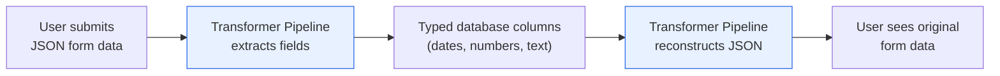
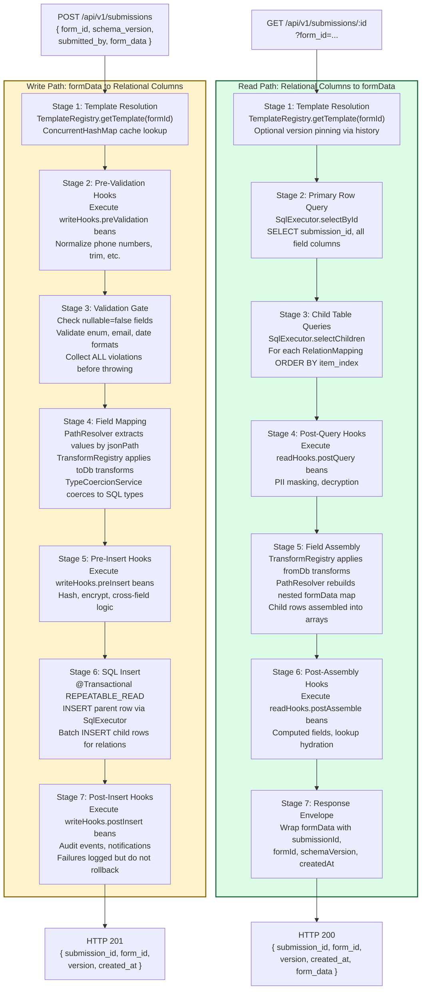
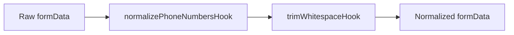
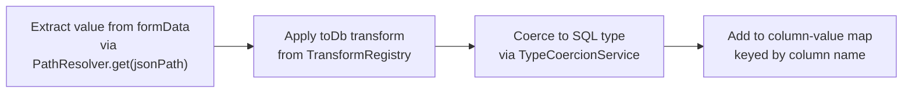
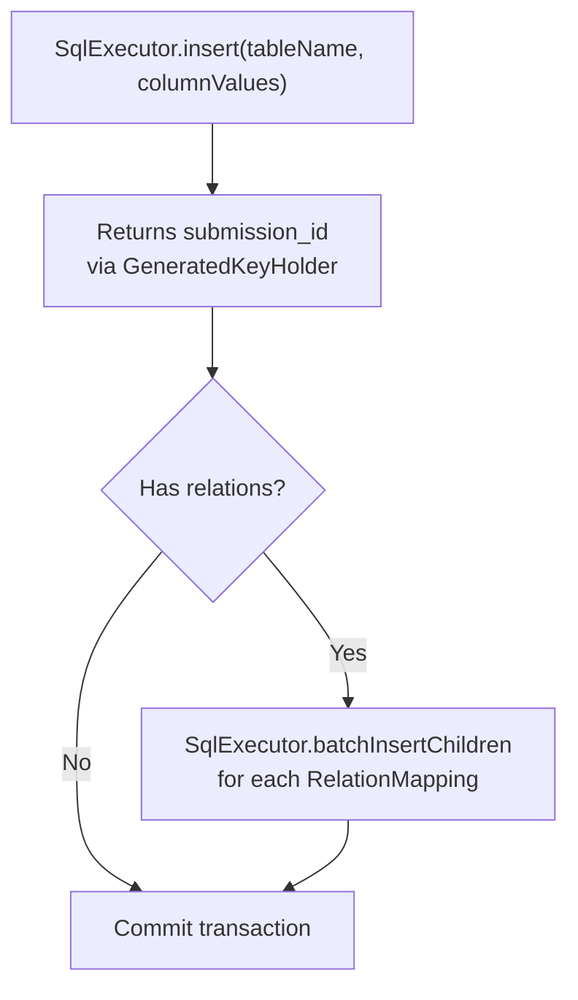
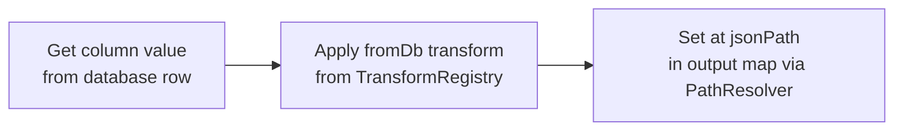
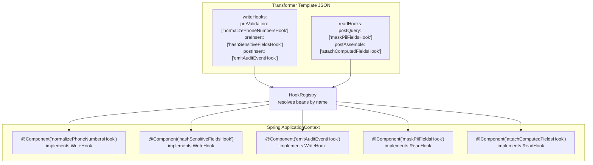

# Transformer Pipeline: Bidirectional JSON-to-Relational Conversion

## Executive Summary

### The Business Problem

Government form data is collected as flexible JSON documents from web-based RJSF forms. While JSON storage is convenient for the frontend, it creates challenges for downstream consumers: reporting tools cannot easily query individual fields, compliance audits require structured data access, and cross-form analytics are impractical when data is locked inside opaque JSON blobs.

### The Solution

The **Transformer Pipeline** is a bidirectional data conversion engine that sits between the form frontend and the database. When a user submits a form, the pipeline automatically extracts each field from the JSON document, applies type-safe conversions, and stores the values in dedicated database columns. When the data is read back, the pipeline reconstructs the original JSON structure from the typed columns.



### Key Business Benefits

- **Queryable data** — Each form field is stored in its own typed database column, enabling direct SQL queries, report generation, and business intelligence without parsing JSON
- **Data integrity** — Dates are stored as dates, numbers as numbers, and budgets as precise decimals. No more string-to-number conversion errors in reports
- **Validation at the gate** — Required fields, allowed values, and format rules are enforced before data reaches the database, reducing data quality issues
- **Extensible without code changes** — Custom business logic (encryption, normalization, audit logging) is injected via named hook points, not hardcoded into the pipeline
- **Round-trip fidelity** — Data written through the pipeline can be read back and reconstructed into the exact same JSON structure, ensuring the user always sees what they submitted
- **Compliance-ready** — Every submission is tagged with a schema version, enabling historical reconstruction of data using the exact template that was active when the form was submitted

### Real-World Example

When a Pre-Award Overview form is submitted with a PI Budget of `$1,448,199.00`:

| Stage | What Happens | Value |
|-------|-------------|-------|
| **JSON Input** | User enters budget in form | `"pi_budget": 1448199` (JavaScript number) |
| **Transform** | `toBigDecimal` converts to precise decimal | `BigDecimal(1448199.00)` |
| **Database** | Stored in typed NUMERIC column | `1448199.00` (15,2 precision) |
| **Read Back** | Column value retrieved | `BigDecimal(1448199.00)` |
| **JSON Output** | Returned to frontend | `"pi_budget": 1448199.0` |

No precision loss. No string parsing. No rounding errors.

---

## Technical Reference

### Pipeline Architecture

The Transformer Pipeline consists of two complementary 7-stage pipelines — one for writes and one for reads — orchestrated by `SubmissionWriteService` and `SubmissionReadService` respectively. Both pipelines are driven by the same Transformer Template, ensuring bidirectional consistency.



### Write Pipeline — Stage by Stage

#### Stage 1: Template Resolution

The `TemplateRegistry` resolves the transformer template by `formId`. The registry maintains an in-memory `ConcurrentHashMap` cache. On cache miss, the template is loaded from disk, validated, and cached.

```java
TransformerTemplate template = templateRegistry.getTemplate(request.formId());
```

If no template exists for the given formId, a `TemplateNotFoundException` is thrown (HTTP 400, error code `TEMPLATE_NOT_FOUND`).

If the request specifies a `schemaVersion` that exceeds the template's version, a `VersionMismatchException` is thrown (HTTP 400, error code `VERSION_MISMATCH`).

#### Stage 2: Pre-Validation Hooks

If the template declares `writeHooks.preValidation` bean names, each `WriteHook` is resolved from the Spring `ApplicationContext` and applied in declared order to the raw `formData` map.



This is the correct stage for data normalization: trimming whitespace, formatting phone numbers to E.164, canonicalizing enum values. Missing hook beans are logged at WARN and skipped — they do not fail the pipeline.

#### Stage 3: Validation Gate

The `ValidationGate` iterates each `FieldMapping` and validates the formData against it:

- **Required fields** (`nullable: false`): Value must be present and non-null
- **Enum constraints**: Value must be in the allowed list
- **Format validation**: Email fields must contain `@`; date fields must parse as ISO-8601

All violations are collected before throwing, so the caller receives a complete error list:

```json
{
  "error": "VALIDATION_FAILED",
  "violations": [
    { "json_path": "program_manager", "message": "Required field is missing" },
    { "json_path": "prime_award_type", "message": "Value 'invalid' is not in allowed values: [extramural, intramural, ...]" }
  ]
}
```

#### Stage 4: Field Mapping

The core transformation stage. For each `FieldMapping` in the template:



**PathResolver** handles dot-notation traversal of nested objects. For example, `personal.email` navigates into `formData.personal.email`.

**Built-in transforms** (13 total):

| Transform | Direction | Behavior |
|-----------|-----------|----------|
| `toLocalDate` | toDb | ISO date string to `java.time.LocalDate` |
| `toIsoDateString` | fromDb | `LocalDate` to `yyyy-MM-dd` string |
| `toInstant` | toDb | ISO datetime to `java.time.Instant` |
| `fromInstant` | fromDb | `Instant` to ISO datetime string |
| `jsonStringify` | toDb | Map/List to JSON string for JSONB columns |
| `jsonParse` | fromDb | JSON string back to Map/List |
| `trimString` | toDb | `String.strip()` |
| `toLowerCase` | toDb | `String.toLowerCase(Locale.ROOT)` |
| `toBoolean` | toDb | Coerce "true"/"false", 1/0 to Boolean |
| `toBigDecimal` | toDb | String or Number to `BigDecimal` |
| `toInteger` | toDb | String or Number to Integer |
| `maskLast4` | fromDb | Mask all but last 4 characters |
| `toUUID` | toDb | Validate and normalize UUID strings |

**Custom transforms** are registered by annotating a class with `@TransformFunction("name")` and implementing `ToDbFunction` or `FromDbFunction`. The `TransformRegistry` discovers them automatically at startup.

#### Stage 5: Pre-Insert Hooks

Applied to the assembled column-value map (not formData). This is the correct stage for:
- Field-level encryption or hashing
- Cross-field business rules (e.g., if field A is "yes", field B must be non-null)
- Computed column values

#### Stage 6: SQL Insert

The `SubmissionWriteService` is annotated `@Transactional(isolation = Isolation.REPEATABLE_READ)`. The `SqlExecutor` performs:

1. **Parent table INSERT** using `NamedParameterJdbcTemplate` with a `GeneratedKeyHolder` to capture the new `submission_id`
2. **Child table batch INSERT** for each `RelationMapping`: iterates the array at the relation's `jsonPath`, maps each element's fields, and executes `batchUpdate()` with `submission_id` and `item_index`



A `DuplicateKeyException` is caught and re-thrown as `DuplicateSubmissionException` (HTTP 409).

#### Stage 7: Post-Insert Hooks

Executed after the SQL insert (but within the same transaction boundary). Common uses:
- Publishing a Spring `ApplicationEvent` for downstream consumers
- Writing to a compliance audit table
- Triggering notifications

Post-insert hook failures are logged at WARN but do not roll back the transaction.

### Read Pipeline — Stage by Stage

#### Stages 1-3: Template Resolution and Queries

The read pipeline mirrors stages 1-3 of the write pipeline in reverse:
1. Resolve the template (optionally pinned to a historical version)
2. `SELECT` the parent row by `submission_id`
3. `SELECT` child rows for each relation, ordered by `item_index`

#### Stage 4: Post-Query Hooks

Applied to the raw database row before field assembly. Use cases:
- PII masking based on the caller's security context
- Decryption of encrypted fields
- Conditional field suppression

#### Stage 5: Field Assembly

The inverse of Stage 4 in the write pipeline. For each `FieldMapping`:



For `RelationMapping` entries, child rows are assembled into arrays and placed at the relation's `jsonPath`.

**PathResolver.set()** creates intermediate maps as needed. For example, setting `personal.email` on an empty map creates `{ "personal": { "email": "..." } }`.

#### Stages 6-7: Post-Assembly Hooks and Response Envelope

Post-assembly hooks receive the fully reconstructed `formData` for final transformations (computed display fields, lookup hydration). The response envelope wraps the formData with metadata.

### API Contract

#### Write Endpoint

```
POST /api/v1/submissions
Content-Type: application/json

{
  "form_id":         "pre-award-overview",
  "schema_version":  1,
  "submitted_by":    "user-uuid",
  "form_data": {
    "pi_budget": 1448199,
    "program_manager": "Naba Bora",
    "prime_award_type": "extramural",
    "personnel": [
      { "name": "John Smith", "organization": "Johns Hopkins", "project_role": "PI/PD" }
    ]
  }
}
```

**Success (HTTP 201):**
```json
{
  "submission_id": 1,
  "form_id": "pre-award-overview",
  "version": 1,
  "created_at": "2026-04-06T14:32:00.000-04:00"
}
```

#### Read Endpoint

```
GET /api/v1/submissions/1?form_id=pre-award-overview
```

**Success (HTTP 200):**
```json
{
  "submission_id": 1,
  "form_id": "pre-award-overview",
  "version": 1,
  "created_at": "2026-04-06T14:32:00.000-04:00",
  "form_data": {
    "pi_budget": 1448199.0,
    "program_manager": "Naba Bora",
    "prime_award_type": "extramural",
    "personnel": [
      { "name": "John Smith", "organization": "Johns Hopkins", "project_role": "PI/PD" }
    ]
  }
}
```

#### Error Responses

| HTTP | Error Code | Condition |
|------|------------|-----------|
| 400 | `TEMPLATE_NOT_FOUND` | No template for the given formId |
| 400 | `VALIDATION_FAILED` | Field constraint violations (includes violations array) |
| 400 | `VERSION_MISMATCH` | Requested schema version exceeds template version |
| 404 | `SUBMISSION_NOT_FOUND` | No row for the given submissionId |
| 409 | `DUPLICATE_SUBMISSION` | Unique constraint violation on target table |

### Hook System

Hooks are Spring beans that implement `WriteHook` or `ReadHook` functional interfaces. They are referenced by bean name in the template JSON and resolved at runtime via the `HookRegistry`.



**Writing a custom hook:**

```java
@Component("normalizePhoneNumbersHook")
public class NormalizePhoneNumbersHook implements WriteHook {
    @Override
    public Map<String, Object> apply(Map<String, Object> data) {
        // Normalize phone fields to E.164 format
        Object phone = data.get("phone");
        if (phone instanceof String s) {
            data.put("phone", normalizeToE164(s));
        }
        return data;
    }
}
```

### Transaction and Safety Guarantees

| Guarantee | Implementation |
|-----------|----------------|
| **Atomic writes** | Parent and child table writes wrapped in `@Transactional(isolation = REPEATABLE_READ)` |
| **Rollback on error** | Any `DataAccessException` triggers Spring's automatic transaction rollback |
| **SQL injection prevention** | All table/column names validated via `IdentifierValidator` regex; all values use named parameters |
| **Additive-only DDL** | `DdlManager` never drops columns or tables |
| **Post-insert isolation** | Post-insert hook failures are caught and logged; they do not roll back the committed data |

### Component Reference

| Component | Package | Role in Pipeline |
|-----------|---------|-----------------|
| `SubmissionWriteService` | `transformer.service` | Orchestrates 7-stage write pipeline |
| `SubmissionReadService` | `transformer.service` | Orchestrates 7-stage read pipeline |
| `TransformerSubmissionController` | `transformer.controller` | REST endpoints: POST + GET |
| `TemplateRegistry` | `transformer.registry` | Template cache and resolution |
| `PathResolver` | `transformer.engine` | Dot-notation get/set on nested maps |
| `TypeCoercionService` | `transformer.engine` | Java value to SQL type coercion |
| `TransformRegistry` | `transformer.transform` | Named transform function registry |
| `BuiltInTransforms` | `transformer.transform` | 13 built-in transform implementations |
| `ValidationGate` | `transformer.validation` | Field validation with violation collection |
| `HookRegistry` | `transformer.hook` | Spring bean resolution by name |
| `SqlExecutor` | `transformer.db` | NamedParameterJdbcTemplate wrappers |
| `DdlManager` | `transformer.ddl` | Dynamic table creation and reconciliation |
| `IdentifierValidator` | `transformer.util` | SQL identifier regex validation |
| `TransformerExceptionHandler` | `transformer.config` | Maps exceptions to HTTP status codes |
