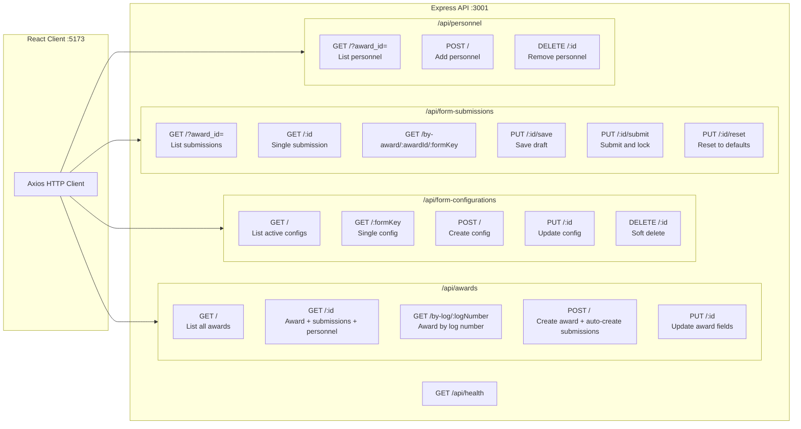

```mermaid
graph LR
    subgraph Client["React Client :5173"]
        AX[Axios HTTP Client]
    end

    subgraph API["Express API :3001"]
        subgraph Awards["/api/awards"]
            A1["GET / <br/>List all awards"]
            A2["GET /:id <br/>Award + submissions + personnel"]
            A3["GET /by-log/:logNumber <br/>Award by log number"]
            A4["POST / <br/>Create award + auto-create submissions"]
            A5["PUT /:id <br/>Update award fields"]
        end

        subgraph FormConfig["/api/form-configurations"]
            FC1["GET / <br/>List active configs"]
            FC2["GET /:formKey <br/>Single config"]
            FC3["POST / <br/>Create config"]
            FC4["PUT /:id <br/>Update config"]
            FC5["DELETE /:id <br/>Soft delete"]
        end

        subgraph FormSub["/api/form-submissions"]
            FS1["GET /?award_id= <br/>List submissions"]
            FS2["GET /:id <br/>Single submission"]
            FS3["GET /by-award/:awardId/:formKey"]
            FS4["PUT /:id/save <br/>Save draft"]
            FS5["PUT /:id/submit <br/>Submit and lock"]
            FS6["PUT /:id/reset <br/>Reset to defaults"]
        end

        subgraph Personnel["/api/personnel"]
            P1["GET /?award_id= <br/>List personnel"]
            P2["POST / <br/>Add personnel"]
            P3["DELETE /:id <br/>Remove personnel"]
        end

        H["GET /api/health"]
    end

    AX --> Awards
    AX --> FormConfig
    AX --> FormSub
    AX --> Personnel
```
