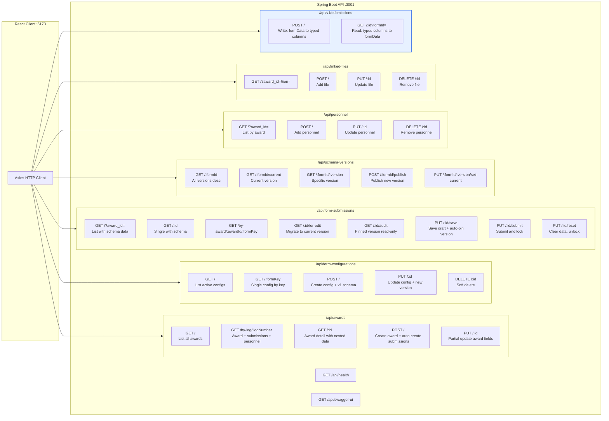

```mermaid
graph LR
    subgraph Client["React Client :5173"]
        AX[Axios HTTP Client]
    end

    subgraph API["Spring Boot API :3001"]
        subgraph Awards["/api/awards"]
            A1["GET / <br/>List all awards"]
            A2["GET /by-log/:logNumber <br/>Award + submissions + personnel"]
            A3["GET /:id <br/>Award detail with nested data"]
            A4["POST / <br/>Create award + auto-create submissions"]
            A5["PUT /:id <br/>Partial update award fields"]
        end

        subgraph FormConfig["/api/form-configurations"]
            FC1["GET / <br/>List active configs"]
            FC2["GET /:formKey <br/>Single config by key"]
            FC3["POST / <br/>Create config + v1 schema"]
            FC4["PUT /:id <br/>Update config + new version"]
            FC5["DELETE /:id <br/>Soft delete"]
        end

        subgraph FormSub["/api/form-submissions"]
            FS1["GET /?award_id= <br/>List with schema data"]
            FS2["GET /:id <br/>Single with schema"]
            FS3["GET /by-award/:awardId/:formKey"]
            FS4["GET /:id/for-edit <br/>Migrate to current version"]
            FS5["GET /:id/audit <br/>Pinned version read-only"]
            FS6["PUT /:id/save <br/>Save draft + auto-pin version"]
            FS7["PUT /:id/submit <br/>Submit and lock"]
            FS8["PUT /:id/reset <br/>Clear data, unlock"]
        end

        subgraph SchemaVer["/api/schema-versions"]
            SV1["GET /:formId <br/>All versions desc"]
            SV2["GET /:formId/current <br/>Current version"]
            SV3["GET /:formId/:version <br/>Specific version"]
            SV4["POST /:formId/publish <br/>Publish new version"]
            SV5["PUT /:formId/:version/set-current"]
        end

        subgraph Personnel["/api/personnel"]
            P1["GET /?award_id= <br/>List by award"]
            P2["POST / <br/>Add personnel"]
            P3["PUT /:id <br/>Update personnel"]
            P4["DELETE /:id <br/>Remove personnel"]
        end

        subgraph LinkedFiles["/api/linked-files"]
            LF1["GET /?award_id=&section="]
            LF2["POST / <br/>Add file"]
            LF3["PUT /:id <br/>Update file"]
            LF4["DELETE /:id <br/>Remove file"]
        end

        subgraph Transformer["/api/v1/submissions"]
            T1["POST / <br/>Write: formData to typed columns"]
            T2["GET /:id?formId= <br/>Read: typed columns to formData"]
        end

        H["GET /api/health"]
        SW["GET /api/swagger-ui"]
    end

    AX --> Awards
    AX --> FormConfig
    AX --> FormSub
    AX --> SchemaVer
    AX --> Personnel
    AX --> LinkedFiles
    AX --> Transformer

    style Transformer fill:#e7f1ff,stroke:#2563eb,stroke-width:2px
```
