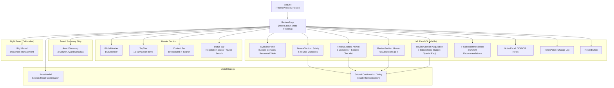

```mermaid
graph TD
    APP["App.jsx<br/>(ThemeProvider, Router)"]
    RP["ReviewPage<br/>(Main Layout, Data Fetching)"]

    APP --> RP

    subgraph Header["Header Section"]
        GH["GlobalHeader<br/>EGS Banner"]
        TN["TopNav<br/>10 Navigation Items"]
        CB["Context Bar<br/>Breadcrumb + Search"]
        SB["Status Bar<br/>Negotiation Status + Quick Search"]
    end

    subgraph Summary["Award Summary Strip"]
        AS["AwardSummary<br/>3-Column Award Metadata"]
    end

    subgraph LeftPanel["Left Panel (Scrollable)"]
        OP["OverviewPanel<br/>Budget, Contacts, Personnel Table"]
        SR1["ReviewSection: Safety<br/>6 Yes/No Questions"]
        SR2["ReviewSection: Animal<br/>5 Questions + Species Checklist"]
        SR3["ReviewSection: Human<br/>6 Subsections (a-f)"]
        SR4["ReviewSection: Acquisition<br/>7 Subsections (Budget-Special Req)"]
        FR["FinalRecommendation<br/>SO/GOR Recommendations"]
        NP1["NotesPanel: SO/GOR Notes"]
        NP2["NotesPanel: Change Log"]
        RST["Reset Button"]
    end

    subgraph RightPnl["Right Panel (Collapsible)"]
        RPnl["RightPanel<br/>Document Management"]
    end

    subgraph Modals["Modal Dialogs"]
        RM["ResetModal<br/>Section Reset Confirmation"]
        CD["Submit Confirmation Dialog<br/>(inside ReviewSection)"]
    end

    RP --> GH
    RP --> TN
    RP --> CB
    RP --> SB
    RP --> AS
    RP --> OP
    RP --> SR1
    RP --> SR2
    RP --> SR3
    RP --> SR4
    RP --> FR
    RP --> NP1
    RP --> NP2
    RP --> RST
    RP --> RPnl
    RP --> RM

    SR1 --> CD
    SR2 --> CD
    SR3 --> CD
    SR4 --> CD
```
