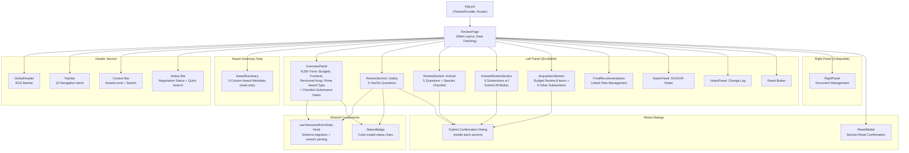

```mermaid
graph TD
    APP["App.jsx<br/>(ThemeProvider, Router)"]
    RP["ReviewPage<br/>(Main Layout, Data Fetching)"]

    APP --> RP

    subgraph Header["Header Section"]
        GH["GlobalHeader<br/>EGS Banner"]
        TN["TopNav<br/>10 Navigation Items"]
        CB["Context Bar<br/>Breadcrumb + Search"]
        STB["Status Bar<br/>Negotiation Status + Quick Search"]
    end

    subgraph Summary["Award Summary Strip"]
        AS["AwardSummary<br/>3-Column Award Metadata (read-only)"]
    end

    subgraph LeftPanel["Left Panel (Scrollable)"]
        OP["OverviewPanel<br/>RJSF Form: Budgets, Contacts,<br/>Personnel Array, Prime Award Type<br/>+ Checklist Submission Dates"]
        SR1["ReviewSection: Safety<br/>6 Yes/No Questions"]
        SR2["ReviewSection: Animal<br/>5 Questions + Species Checklist"]
        HRS["HumanReviewSection<br/>6 Subsections a-f<br/>Submit All Button"]
        AQS["AcquisitionSection<br/>Budget Review 8 items +<br/>6 Other Subsections"]
        FR["FinalRecommendation<br/>Linked Files Management"]
        NP1["NotesPanel: SO/GOR Notes"]
        NP2["NotesPanel: Change Log"]
        RST["Reset Button"]
    end

    subgraph RightPnl["Right Panel (Collapsible)"]
        RPnl["RightPanel<br/>Document Management"]
    end

    subgraph SharedComponents["Shared Components"]
        SBDG["StatusBadge<br/>Color-coded status chips"]
        VFD["useVersionedFormData Hook<br/>Schema migration + version pinning"]
    end

    subgraph Modals["Modal Dialogs"]
        RM["ResetModal<br/>Section Reset Confirmation"]
        CD["Submit Confirmation Dialog<br/>(inside each section)"]
    end

    RP --> GH
    RP --> TN
    RP --> CB
    RP --> STB
    RP --> AS
    RP --> OP
    RP --> SR1
    RP --> SR2
    RP --> HRS
    RP --> AQS
    RP --> FR
    RP --> NP1
    RP --> NP2
    RP --> RST
    RP --> RPnl
    RP --> RM

    OP --> VFD
    OP --> SBDG
    SR1 --> VFD
    SR1 --> SBDG
    SR1 --> CD
    SR2 --> CD
    HRS --> CD
    AQS --> CD
```
