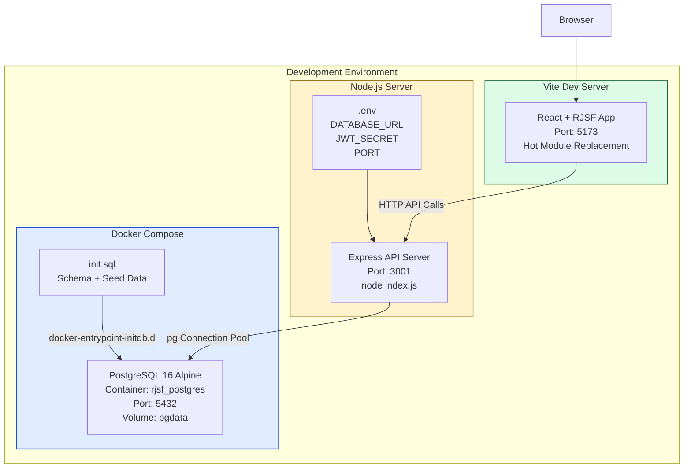

```mermaid
graph TB
    subgraph Dev["Development Environment"]
        subgraph Docker["Docker Compose"]
            PG["PostgreSQL 16 Alpine<br/>Container: rjsf_postgres<br/>Port: 5432<br/>Volume: pgdata"]
            INIT["init.sql<br/>Schema + Seed Data"]
            INIT -->|docker-entrypoint-initdb.d| PG
        end

        subgraph NodeServer["Node.js Server"]
            EXP["Express API Server<br/>Port: 3001<br/>node index.js"]
            ENV[".env<br/>DATABASE_URL<br/>JWT_SECRET<br/>PORT"]
            ENV --> EXP
        end

        subgraph ViteDev["Vite Dev Server"]
            VITE["React + RJSF App<br/>Port: 5173<br/>Hot Module Replacement"]
        end

        VITE -->|HTTP API Calls| EXP
        EXP -->|pg Connection Pool| PG
    end

    USER["Browser"] --> VITE

    style Docker fill:#e0ecff,stroke:#1d4ed8
    style NodeServer fill:#fff3cd,stroke:#856404
    style ViteDev fill:#dcfce7,stroke:#166534
```
