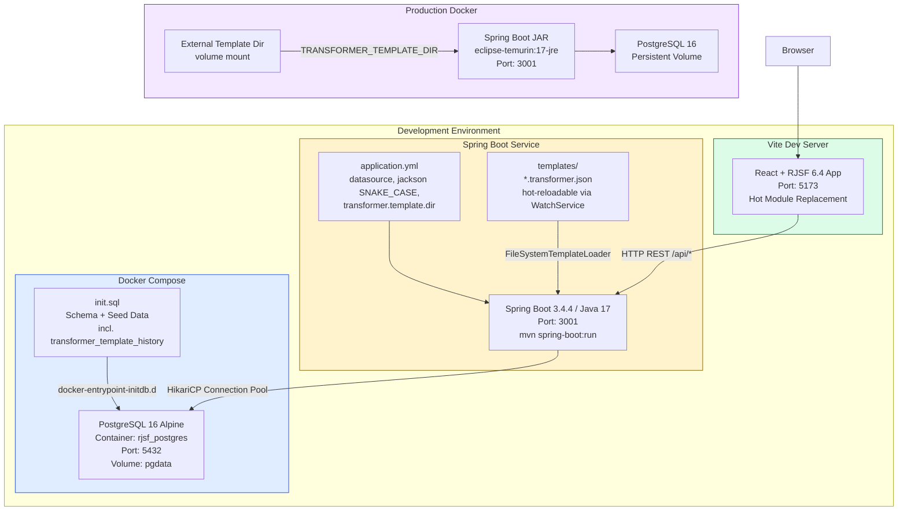

```mermaid
graph TB
    subgraph Dev["Development Environment"]
        subgraph Docker["Docker Compose"]
            PG["PostgreSQL 16 Alpine<br/>Container: rjsf_postgres<br/>Port: 5432<br/>Volume: pgdata"]
            INIT["init.sql<br/>Schema + Seed Data<br/>incl. transformer_template_history"]
            INIT -->|docker-entrypoint-initdb.d| PG
        end

        subgraph SpringBoot["Spring Boot Service"]
            SB["Spring Boot 3.4.4 / Java 17<br/>Port: 3001<br/>mvn spring-boot:run"]
            YML["application.yml<br/>datasource, jackson SNAKE_CASE,<br/>transformer.template.dir"]
            TMPL["templates/<br/>*.transformer.json<br/>hot-reloadable via WatchService"]
            YML --> SB
            TMPL -->|FileSystemTemplateLoader| SB
        end

        subgraph ViteDev["Vite Dev Server"]
            VITE["React + RJSF 6.4 App<br/>Port: 5173<br/>Hot Module Replacement"]
        end

        VITE -->|HTTP REST /api/*| SB
        SB -->|HikariCP Connection Pool| PG
    end

    subgraph Prod["Production Docker"]
        PG_PROD["PostgreSQL 16<br/>Persistent Volume"]
        SB_PROD["Spring Boot JAR<br/>eclipse-temurin:17-jre<br/>Port: 3001"]
        TMPL_PROD["External Template Dir<br/>volume mount"]
        TMPL_PROD -->|TRANSFORMER_TEMPLATE_DIR| SB_PROD
        SB_PROD --> PG_PROD
    end

    USER["Browser"] --> VITE

    style Docker fill:#e0ecff,stroke:#1d4ed8
    style SpringBoot fill:#fff3cd,stroke:#856404
    style ViteDev fill:#dcfce7,stroke:#166534
    style Prod fill:#f3e8ff,stroke:#7e22ce
```
