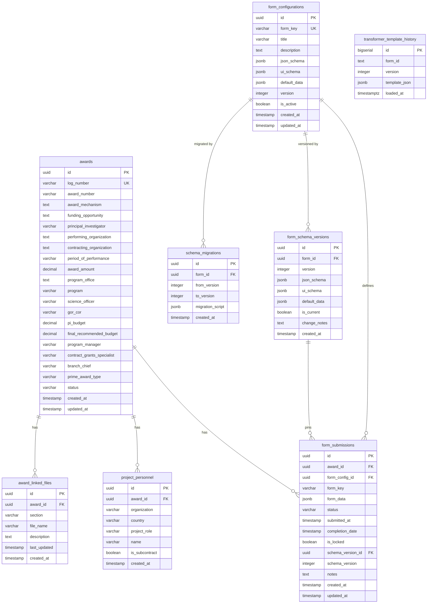

```mermaid
erDiagram
    awards {
        uuid id PK
        varchar log_number UK
        varchar award_number
        text award_mechanism
        text funding_opportunity
        varchar principal_investigator
        text performing_organization
        text contracting_organization
        varchar period_of_performance
        decimal award_amount
        text program_office
        varchar program
        varchar science_officer
        varchar gor_cor
        decimal pi_budget
        decimal final_recommended_budget
        varchar program_manager
        varchar contract_grants_specialist
        varchar branch_chief
        varchar prime_award_type
        varchar status
        timestamp created_at
        timestamp updated_at
    }

    form_configurations {
        uuid id PK
        varchar form_key UK
        varchar title
        text description
        jsonb json_schema
        jsonb ui_schema
        jsonb default_data
        integer version
        boolean is_active
        timestamp created_at
        timestamp updated_at
    }

    form_submissions {
        uuid id PK
        uuid award_id FK
        uuid form_config_id FK
        varchar form_key
        jsonb form_data
        varchar status
        timestamp submitted_at
        timestamp completion_date
        boolean is_locked
        uuid schema_version_id FK
        integer schema_version
        text notes
        timestamp created_at
        timestamp updated_at
    }

    form_schema_versions {
        uuid id PK
        uuid form_id FK
        integer version
        jsonb json_schema
        jsonb ui_schema
        jsonb default_data
        boolean is_current
        text change_notes
        timestamp created_at
    }

    schema_migrations {
        uuid id PK
        uuid form_id FK
        integer from_version
        integer to_version
        jsonb migration_script
        timestamp created_at
    }

    project_personnel {
        uuid id PK
        uuid award_id FK
        varchar organization
        varchar country
        varchar project_role
        varchar name
        boolean is_subcontract
        timestamp created_at
    }

    award_linked_files {
        uuid id PK
        uuid award_id FK
        varchar section
        varchar file_name
        text description
        timestamp last_updated
        timestamp created_at
    }

    transformer_template_history {
        bigserial id PK
        text form_id
        integer version
        jsonb template_json
        timestamptz loaded_at
    }

    awards ||--o{ form_submissions : "has"
    awards ||--o{ project_personnel : "has"
    awards ||--o{ award_linked_files : "has"
    form_configurations ||--o{ form_submissions : "defines"
    form_configurations ||--o{ form_schema_versions : "versioned by"
    form_configurations ||--o{ schema_migrations : "migrated by"
    form_schema_versions ||--o{ form_submissions : "pins"
```
