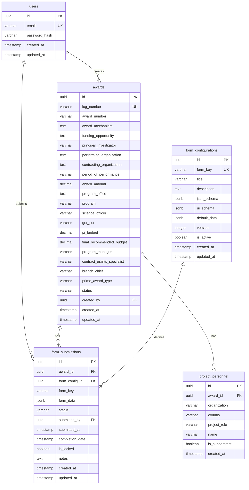

```mermaid
erDiagram
    users {
        uuid id PK
        varchar email UK
        varchar password_hash
        timestamp created_at
        timestamp updated_at
    }

    awards {
        uuid id PK
        varchar log_number UK
        varchar award_number
        text award_mechanism
        text funding_opportunity
        varchar principal_investigator
        text performing_organization
        text contracting_organization
        varchar period_of_performance
        decimal award_amount
        text program_office
        varchar program
        varchar science_officer
        varchar gor_cor
        decimal pi_budget
        decimal final_recommended_budget
        varchar program_manager
        varchar contract_grants_specialist
        varchar branch_chief
        varchar prime_award_type
        varchar status
        uuid created_by FK
        timestamp created_at
        timestamp updated_at
    }

    form_configurations {
        uuid id PK
        varchar form_key UK
        varchar title
        text description
        jsonb json_schema
        jsonb ui_schema
        jsonb default_data
        integer version
        boolean is_active
        timestamp created_at
        timestamp updated_at
    }

    form_submissions {
        uuid id PK
        uuid award_id FK
        uuid form_config_id FK
        varchar form_key
        jsonb form_data
        varchar status
        uuid submitted_by FK
        timestamp submitted_at
        timestamp completion_date
        boolean is_locked
        text notes
        timestamp created_at
        timestamp updated_at
    }

    project_personnel {
        uuid id PK
        uuid award_id FK
        varchar organization
        varchar country
        varchar project_role
        varchar name
        boolean is_subcontract
        timestamp created_at
    }

    users ||--o{ awards : "creates"
    users ||--o{ form_submissions : "submits"
    awards ||--o{ form_submissions : "has"
    awards ||--o{ project_personnel : "has"
    form_configurations ||--o{ form_submissions : "defines"
```
