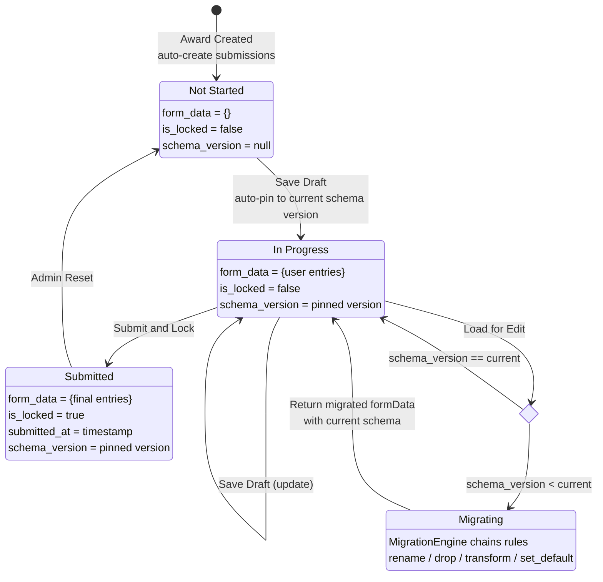

```mermaid
stateDiagram-v2
    [*] --> not_started: Award Created<br/>auto-create submissions

    not_started --> in_progress: Save Draft<br/>auto-pin to current schema version
    in_progress --> in_progress: Save Draft (update)
    in_progress --> submitted: Submit and Lock
    submitted --> not_started: Admin Reset

    not_started: Not Started
    not_started: form_data = {}
    not_started: is_locked = false
    not_started: schema_version = null

    in_progress: In Progress
    in_progress: form_data = {user entries}
    in_progress: is_locked = false
    in_progress: schema_version = pinned version

    submitted: Submitted
    submitted: form_data = {final entries}
    submitted: is_locked = true
    submitted: submitted_at = timestamp
    submitted: schema_version = pinned version

    state version_check <<choice>>
    in_progress --> version_check: Load for Edit
    version_check --> in_progress: schema_version == current
    version_check --> migrating: schema_version < current

    migrating: Migrating
    migrating: MigrationEngine chains rules
    migrating: rename / drop / transform / set_default
    migrating --> in_progress: Return migrated formData<br/>with current schema
```
