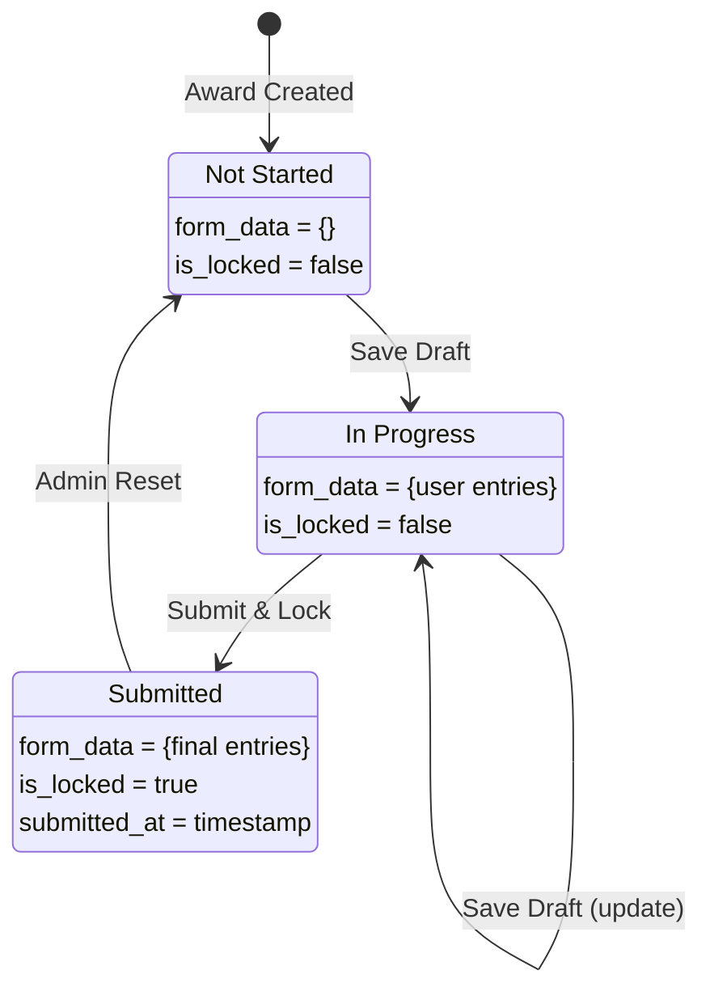

```mermaid
stateDiagram-v2
    [*] --> not_started: Award Created
    not_started --> in_progress: Save Draft
    in_progress --> in_progress: Save Draft (update)
    in_progress --> submitted: Submit & Lock
    submitted --> not_started: Admin Reset

    not_started: Not Started
    not_started: form_data = {}
    not_started: is_locked = false

    in_progress: In Progress
    in_progress: form_data = {user entries}
    in_progress: is_locked = false

    submitted: Submitted
    submitted: form_data = {final entries}
    submitted: is_locked = true
    submitted: submitted_at = timestamp
```
