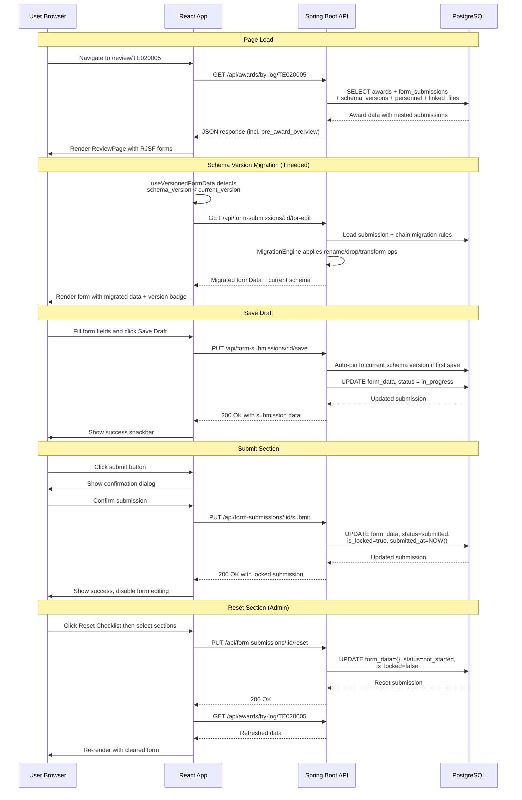

```mermaid
sequenceDiagram
    participant U as User Browser
    participant R as React App
    participant A as Spring Boot API
    participant D as PostgreSQL

    Note over U,D: Page Load
    U->>R: Navigate to /review/TE020005
    R->>A: GET /api/awards/by-log/TE020005
    A->>D: SELECT awards + form_submissions<br/>+ schema_versions + personnel + linked_files
    D-->>A: Award data with nested submissions
    A-->>R: JSON response (incl. pre_award_overview)
    R->>U: Render ReviewPage with RJSF forms

    Note over U,D: Schema Version Migration (if needed)
    R->>R: useVersionedFormData detects<br/>schema_version < current_version
    R->>A: GET /api/form-submissions/:id/for-edit
    A->>D: Load submission + chain migration rules
    A->>A: MigrationEngine applies rename/drop/transform ops
    A-->>R: Migrated formData + current schema
    R->>U: Render form with migrated data + version badge

    Note over U,D: Save Draft
    U->>R: Fill form fields and click Save Draft
    R->>A: PUT /api/form-submissions/:id/save
    A->>D: Auto-pin to current schema version if first save
    A->>D: UPDATE form_data, status = in_progress
    D-->>A: Updated submission
    A-->>R: 200 OK with submission data
    R->>U: Show success snackbar

    Note over U,D: Submit Section
    U->>R: Click submit button
    R->>U: Show confirmation dialog
    U->>R: Confirm submission
    R->>A: PUT /api/form-submissions/:id/submit
    A->>D: UPDATE form_data, status=submitted,<br/>is_locked=true, submitted_at=NOW()
    D-->>A: Updated submission
    A-->>R: 200 OK with locked submission
    R->>U: Show success, disable form editing

    Note over U,D: Reset Section (Admin)
    U->>R: Click Reset Checklist then select sections
    R->>A: PUT /api/form-submissions/:id/reset
    A->>D: UPDATE form_data={}, status=not_started,<br/>is_locked=false
    D-->>A: Reset submission
    A-->>R: 200 OK
    R->>A: GET /api/awards/by-log/TE020005
    A-->>R: Refreshed data
    R->>U: Re-render with cleared form
```
