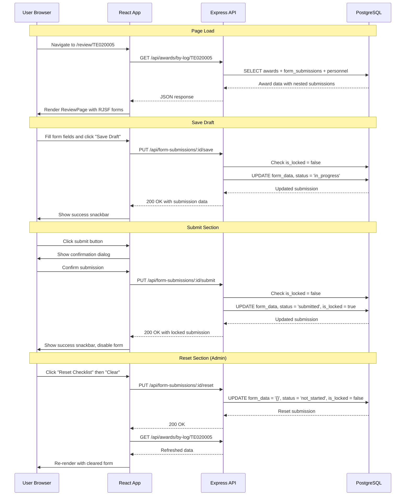

```mermaid
sequenceDiagram
    participant U as User Browser
    participant R as React App
    participant A as Express API
    participant D as PostgreSQL

    Note over U,D: Page Load
    U->>R: Navigate to /review/TE020005
    R->>A: GET /api/awards/by-log/TE020005
    A->>D: SELECT awards + form_submissions + personnel
    D-->>A: Award data with nested submissions
    A-->>R: JSON response
    R->>U: Render ReviewPage with RJSF forms

    Note over U,D: Save Draft
    U->>R: Fill form fields and click "Save Draft"
    R->>A: PUT /api/form-submissions/:id/save
    A->>D: Check is_locked = false
    A->>D: UPDATE form_data, status = 'in_progress'
    D-->>A: Updated submission
    A-->>R: 200 OK with submission data
    R->>U: Show success snackbar

    Note over U,D: Submit Section
    U->>R: Click submit button
    R->>U: Show confirmation dialog
    U->>R: Confirm submission
    R->>A: PUT /api/form-submissions/:id/submit
    A->>D: Check is_locked = false
    A->>D: UPDATE form_data, status = 'submitted', is_locked = true
    D-->>A: Updated submission
    A-->>R: 200 OK with locked submission
    R->>U: Show success snackbar, disable form

    Note over U,D: Reset Section (Admin)
    U->>R: Click "Reset Checklist" then "Clear"
    R->>A: PUT /api/form-submissions/:id/reset
    A->>D: UPDATE form_data = '{}', status = 'not_started', is_locked = false
    D-->>A: Reset submission
    A-->>R: 200 OK
    R->>A: GET /api/awards/by-log/TE020005
    A-->>R: Refreshed data
    R->>U: Re-render with cleared form
```
