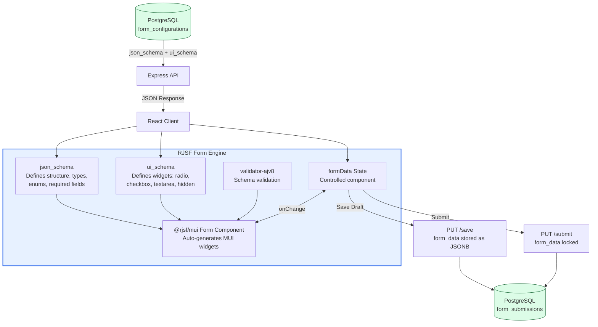

```mermaid
flowchart TD
    DB[(PostgreSQL<br/>form_configurations)]
    DB -->|json_schema + ui_schema| API[Express API]
    API -->|JSON Response| Client[React Client]

    subgraph RJSF["RJSF Form Engine"]
        JS[json_schema<br/>Defines structure, types,<br/>enums, required fields]
        US[ui_schema<br/>Defines widgets: radio,<br/>checkbox, textarea, hidden]
        VAL[validator-ajv8<br/>Schema validation]
        FORM["@rjsf/mui Form Component<br/>Auto-generates MUI widgets"]
        FD[formData State<br/>Controlled component]

        JS --> FORM
        US --> FORM
        VAL --> FORM
        FD <-->|onChange| FORM
    end

    Client --> JS
    Client --> US
    Client --> FD

    FD -->|Save Draft| SAVE[PUT /save<br/>form_data stored as JSONB]
    FD -->|Submit| SUB[PUT /submit<br/>form_data locked]
    SAVE --> DB2[(PostgreSQL<br/>form_submissions)]
    SUB --> DB2

    style RJSF fill:#e7f1ff,stroke:#2563eb,stroke-width:2px
    style DB fill:#dcfce7,stroke:#166534
    style DB2 fill:#dcfce7,stroke:#166534
```
