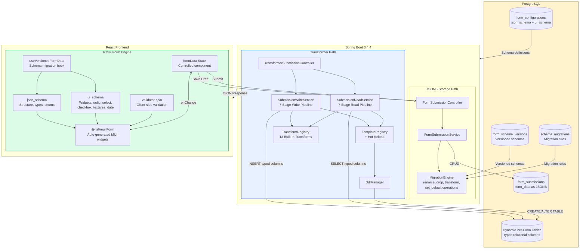

```mermaid
flowchart TD
    subgraph DB["PostgreSQL"]
        FC[(form_configurations<br/>json_schema + ui_schema)]
        FS[(form_submissions<br/>form_data as JSONB)]
        SV[(form_schema_versions<br/>Versioned schemas)]
        SM[(schema_migrations<br/>Migration rules)]
        DYN[("Dynamic Per-Form Tables<br/>typed relational columns")]
    end

    subgraph API["Spring Boot 3.4.4"]
        subgraph ExistingPath["JSONB Storage Path"]
            CTRL[FormSubmissionController]
            SVC[FormSubmissionService]
            MIG[MigrationEngine<br/>rename, drop, transform,<br/>set_default operations]
            CTRL --> SVC
            SVC --> MIG
        end

        subgraph TransformerPath["Transformer Path"]
            T_CTL[TransformerSubmissionController]
            T_WR[SubmissionWriteService<br/>7-Stage Write Pipeline]
            T_RD[SubmissionReadService<br/>7-Stage Read Pipeline]
            T_REG[TemplateRegistry<br/>+ Hot Reload]
            T_TRN[TransformRegistry<br/>13 Built-In Transforms]
            T_DDL[DdlManager]

            T_CTL --> T_WR
            T_CTL --> T_RD
            T_WR --> T_REG
            T_WR --> T_TRN
            T_RD --> T_REG
            T_RD --> T_TRN
            T_REG --> T_DDL
        end
    end

    subgraph Client["React Frontend"]
        subgraph RJSF["RJSF Form Engine"]
            JS["json_schema<br/>Structure, types, enums"]
            US["ui_schema<br/>Widgets: radio, select,<br/>checkbox, textarea, date"]
            VAL["validator-ajv8<br/>Client-side validation"]
            FORM["@rjsf/mui Form<br/>Auto-generated MUI widgets"]
            FD["formData State<br/>Controlled component"]
            VH["useVersionedFormData<br/>Schema migration hook"]

            VH --> JS
            VH --> US
            JS --> FORM
            US --> FORM
            VAL --> FORM
            FD <-->|onChange| FORM
        end
    end

    FC -->|Schema definitions| API
    SV -->|Versioned schemas| MIG
    SM -->|Migration rules| MIG
    SVC -->|CRUD| FS
    T_WR -->|INSERT typed columns| DYN
    T_RD -->|SELECT typed columns| DYN
    T_DDL -->|CREATE/ALTER TABLE| DYN

    API -->|JSON Response| Client
    FD -->|Save Draft| CTRL
    FD -->|Submit| CTRL

    style TransformerPath fill:#e7f1ff,stroke:#2563eb,stroke-width:2px
    style RJSF fill:#dcfce7,stroke:#166534,stroke-width:2px
    style DB fill:#fff3cd,stroke:#856404
```
