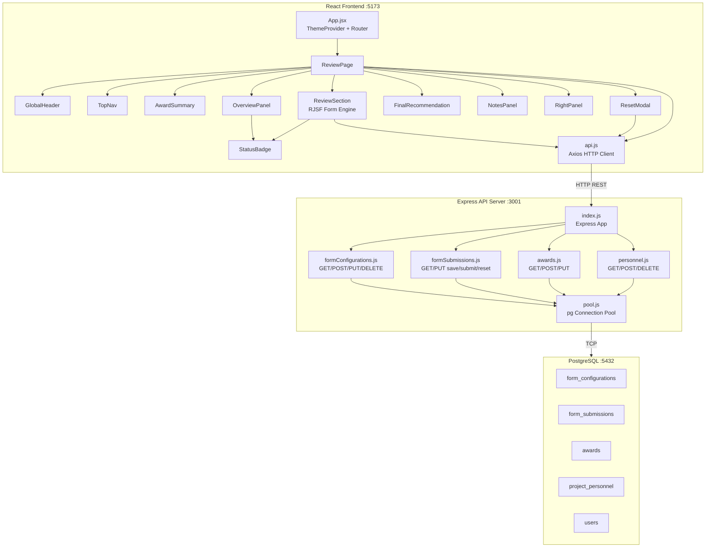

```mermaid
graph TB
    subgraph Client["React Frontend :5173"]
        APP[App.jsx<br/>ThemeProvider + Router]
        RP[ReviewPage]
        GH[GlobalHeader]
        TN[TopNav]
        AS[AwardSummary]
        OP[OverviewPanel]
        RS[ReviewSection<br/>RJSF Form Engine]
        FR[FinalRecommendation]
        NP[NotesPanel]
        RPnl[RightPanel]
        RM[ResetModal]
        SB[StatusBadge]
        API[api.js<br/>Axios HTTP Client]

        APP --> RP
        RP --> GH
        RP --> TN
        RP --> AS
        RP --> OP
        RP --> RS
        RP --> FR
        RP --> NP
        RP --> RPnl
        RP --> RM
        RS --> SB
        OP --> SB
        RP --> API
        RS --> API
        RM --> API
    end

    subgraph Server["Express API Server :3001"]
        IDX[index.js<br/>Express App]
        FC[formConfigurations.js<br/>GET/POST/PUT/DELETE]
        FS[formSubmissions.js<br/>GET/PUT save/submit/reset]
        AW[awards.js<br/>GET/POST/PUT]
        PR[personnel.js<br/>GET/POST/DELETE]
        PL[pool.js<br/>pg Connection Pool]

        IDX --> FC
        IDX --> FS
        IDX --> AW
        IDX --> PR
        FC --> PL
        FS --> PL
        AW --> PL
        PR --> PL
    end

    subgraph DB["PostgreSQL :5432"]
        TBL_FC[form_configurations]
        TBL_FS[form_submissions]
        TBL_AW[awards]
        TBL_PP[project_personnel]
        TBL_US[users]
    end

    API -->|HTTP REST| IDX
    PL -->|TCP| DB
```
