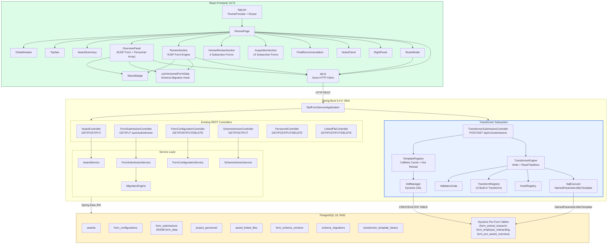

```mermaid
graph TB
    subgraph Client["React Frontend :5173"]
        APP[App.jsx<br/>ThemeProvider + Router]
        RP[ReviewPage]
        GH[GlobalHeader]
        TN[TopNav]
        AS[AwardSummary]
        OP["OverviewPanel<br/>(RJSF Form + Personnel Array)"]
        RS[ReviewSection<br/>RJSF Form Engine]
        HRS[HumanReviewSection<br/>6 Subsection Forms]
        AQS[AcquisitionSection<br/>14 Subsection Forms]
        FR[FinalRecommendation]
        NP[NotesPanel]
        RPnl[RightPanel]
        RM[ResetModal]
        SB[StatusBadge]
        VH[useVersionedFormData<br/>Schema Migration Hook]
        API[api.js<br/>Axios HTTP Client]

        APP --> RP
        RP --> GH
        RP --> TN
        RP --> AS
        RP --> OP
        RP --> RS
        RP --> HRS
        RP --> AQS
        RP --> FR
        RP --> NP
        RP --> RPnl
        RP --> RM
        RS --> SB
        RS --> VH
        OP --> SB
        OP --> VH
        RP --> API
        RS --> API
        OP --> API
        RM --> API
    end

    subgraph Server["Spring Boot 3.4.4 :3001"]
        SB_APP[RjsfFormServiceApplication]

        subgraph ExistingAPI["Existing REST Controllers"]
            AW_C[AwardController<br/>GET/POST/PUT]
            FS_C[FormSubmissionController<br/>GET/PUT save/submit/reset]
            FC_C[FormConfigurationController<br/>GET/POST/PUT/DELETE]
            SV_C[SchemaVersionController<br/>GET/POST/PUT]
            PR_C[PersonnelController<br/>GET/POST/PUT/DELETE]
            LF_C[LinkedFileController<br/>GET/POST/PUT/DELETE]
        end

        subgraph TransformerAPI["Transformer Subsystem"]
            T_CTL["TransformerSubmissionController<br/>POST/GET /api/v1/submissions"]
            T_REG[TemplateRegistry<br/>Caffeine Cache + Hot Reload]
            T_ENG[TransformerEngine<br/>Write + Read Pipelines]
            T_DDL[DdlManager<br/>Dynamic DDL]
            T_SQL[SqlExecutor<br/>NamedParameterJdbcTemplate]
            T_VAL[ValidationGate]
            T_TRN[TransformRegistry<br/>13 Built-In Transforms]
            T_HK[HookRegistry]

            T_CTL --> T_REG
            T_CTL --> T_ENG
            T_ENG --> T_VAL
            T_ENG --> T_TRN
            T_ENG --> T_HK
            T_ENG --> T_SQL
            T_REG --> T_DDL
        end

        subgraph Services["Service Layer"]
            AW_S[AwardService]
            FS_S[FormSubmissionService]
            FC_S[FormConfigurationService]
            SV_S[SchemaVersionService]
            ME[MigrationEngine]
        end

        SB_APP --> ExistingAPI
        SB_APP --> TransformerAPI
        AW_C --> AW_S
        FS_C --> FS_S
        FC_C --> FC_S
        SV_C --> SV_S
        FS_S --> ME
    end

    subgraph DB["PostgreSQL 16 :5432"]
        TBL_AW[awards]
        TBL_FC[form_configurations]
        TBL_FS[form_submissions<br/>JSONB form_data]
        TBL_PP[project_personnel]
        TBL_LF[award_linked_files]
        TBL_SV[form_schema_versions]
        TBL_SM[schema_migrations]
        TBL_TH[transformer_template_history]
        TBL_DYN["Dynamic Per-Form Tables<br/>(form_animal_research,<br/>form_employee_onboarding,<br/>form_pre_award_overview)"]
    end

    API -->|HTTP REST| SB_APP
    Services -->|Spring Data JPA| DB
    T_SQL -->|NamedParameterJdbcTemplate| TBL_DYN
    T_DDL -->|CREATE/ALTER TABLE| TBL_DYN

    style TransformerAPI fill:#e7f1ff,stroke:#2563eb,stroke-width:2px
    style Client fill:#dcfce7,stroke:#166534
    style DB fill:#fff3cd,stroke:#856404
```
