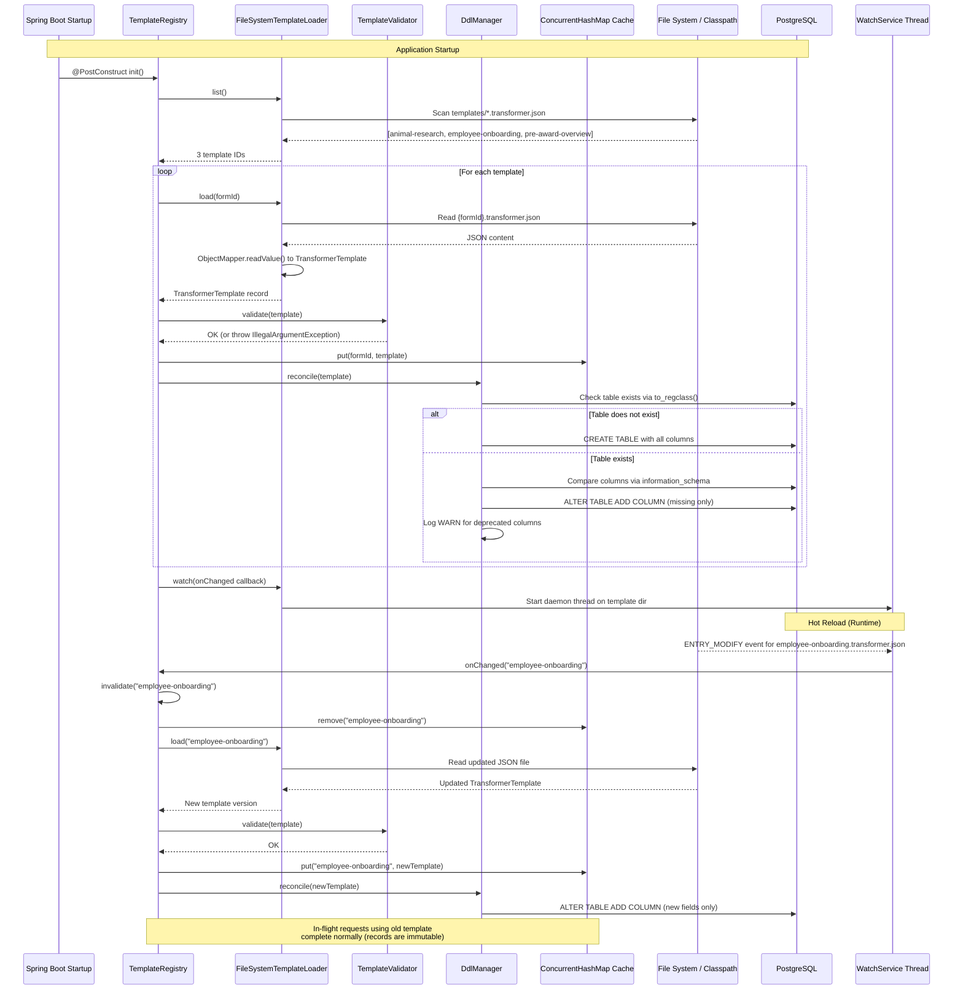

```mermaid
sequenceDiagram
    participant App as Spring Boot Startup
    participant Reg as TemplateRegistry
    participant Ldr as FileSystemTemplateLoader
    participant Val as TemplateValidator
    participant DDL as DdlManager
    participant Cache as ConcurrentHashMap Cache
    participant FS as File System / Classpath
    participant DB as PostgreSQL
    participant WS as WatchService Thread

    Note over App,DB: Application Startup
    App->>Reg: @PostConstruct init()
    Reg->>Ldr: list()
    Ldr->>FS: Scan templates/*.transformer.json
    FS-->>Ldr: [animal-research, employee-onboarding, pre-award-overview]
    Ldr-->>Reg: 3 template IDs

    loop For each template
        Reg->>Ldr: load(formId)
        Ldr->>FS: Read {formId}.transformer.json
        FS-->>Ldr: JSON content
        Ldr->>Ldr: ObjectMapper.readValue() to TransformerTemplate
        Ldr-->>Reg: TransformerTemplate record
        Reg->>Val: validate(template)
        Val-->>Reg: OK (or throw IllegalArgumentException)
        Reg->>Cache: put(formId, template)
        Reg->>DDL: reconcile(template)
        DDL->>DB: Check table exists via to_regclass()
        alt Table does not exist
            DDL->>DB: CREATE TABLE with all columns
        else Table exists
            DDL->>DB: Compare columns via information_schema
            DDL->>DB: ALTER TABLE ADD COLUMN (missing only)
            DDL->>DDL: Log WARN for deprecated columns
        end
    end

    Reg->>Ldr: watch(onChanged callback)
    Ldr->>WS: Start daemon thread on template dir

    Note over WS,DB: Hot Reload (Runtime)
    FS-->>WS: ENTRY_MODIFY event for employee-onboarding.transformer.json
    WS->>Reg: onChanged("employee-onboarding")
    Reg->>Reg: invalidate("employee-onboarding")
    Reg->>Cache: remove("employee-onboarding")
    Reg->>Ldr: load("employee-onboarding")
    Ldr->>FS: Read updated JSON file
    FS-->>Ldr: Updated TransformerTemplate
    Ldr-->>Reg: New template version
    Reg->>Val: validate(template)
    Val-->>Reg: OK
    Reg->>Cache: put("employee-onboarding", newTemplate)
    Reg->>DDL: reconcile(newTemplate)
    DDL->>DB: ALTER TABLE ADD COLUMN (new fields only)

    Note over Reg,Cache: In-flight requests using old template<br/>complete normally (records are immutable)
```
