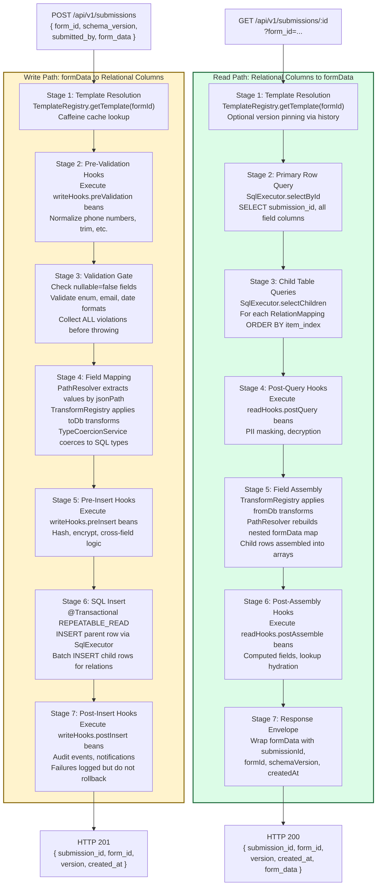

```mermaid
flowchart TB
    subgraph WritePath["Write Path: formData to Relational Columns"]
        W1["Stage 1: Template Resolution<br/>TemplateRegistry.getTemplate(formId)<br/>Caffeine cache lookup"]
        W2["Stage 2: Pre-Validation Hooks<br/>Execute writeHooks.preValidation beans<br/>Normalize phone numbers, trim, etc."]
        W3["Stage 3: Validation Gate<br/>Check nullable=false fields<br/>Validate enum, email, date formats<br/>Collect ALL violations before throwing"]
        W4["Stage 4: Field Mapping<br/>PathResolver extracts values by jsonPath<br/>TransformRegistry applies toDb transforms<br/>TypeCoercionService coerces to SQL types"]
        W5["Stage 5: Pre-Insert Hooks<br/>Execute writeHooks.preInsert beans<br/>Hash, encrypt, cross-field logic"]
        W6["Stage 6: SQL Insert<br/>@Transactional REPEATABLE_READ<br/>INSERT parent row via SqlExecutor<br/>Batch INSERT child rows for relations"]
        W7["Stage 7: Post-Insert Hooks<br/>Execute writeHooks.postInsert beans<br/>Audit events, notifications<br/>Failures logged but do not rollback"]

        W1 --> W2 --> W3 --> W4 --> W5 --> W6 --> W7
    end

    subgraph ReadPath["Read Path: Relational Columns to formData"]
        R1["Stage 1: Template Resolution<br/>TemplateRegistry.getTemplate(formId)<br/>Optional version pinning via history"]
        R2["Stage 2: Primary Row Query<br/>SqlExecutor.selectById<br/>SELECT submission_id, all field columns"]
        R3["Stage 3: Child Table Queries<br/>SqlExecutor.selectChildren<br/>For each RelationMapping ORDER BY item_index"]
        R4["Stage 4: Post-Query Hooks<br/>Execute readHooks.postQuery beans<br/>PII masking, decryption"]
        R5["Stage 5: Field Assembly<br/>TransformRegistry applies fromDb transforms<br/>PathResolver rebuilds nested formData map<br/>Child rows assembled into arrays"]
        R6["Stage 6: Post-Assembly Hooks<br/>Execute readHooks.postAssemble beans<br/>Computed fields, lookup hydration"]
        R7["Stage 7: Response Envelope<br/>Wrap formData with submissionId,<br/>formId, schemaVersion, createdAt"]

        R1 --> R2 --> R3 --> R4 --> R5 --> R6 --> R7
    end

    REQ_W["POST /api/v1/submissions<br/>{ form_id, schema_version,<br/>submitted_by, form_data }"] --> W1
    W7 --> RESP_W["HTTP 201<br/>{ submission_id, form_id,<br/>version, created_at }"]

    REQ_R["GET /api/v1/submissions/:id<br/>?form_id=..."] --> R1
    R7 --> RESP_R["HTTP 200<br/>{ submission_id, form_id,<br/>version, created_at, form_data }"]

    style WritePath fill:#fff3cd,stroke:#856404,stroke-width:2px
    style ReadPath fill:#dcfce7,stroke:#166534,stroke-width:2px
```
